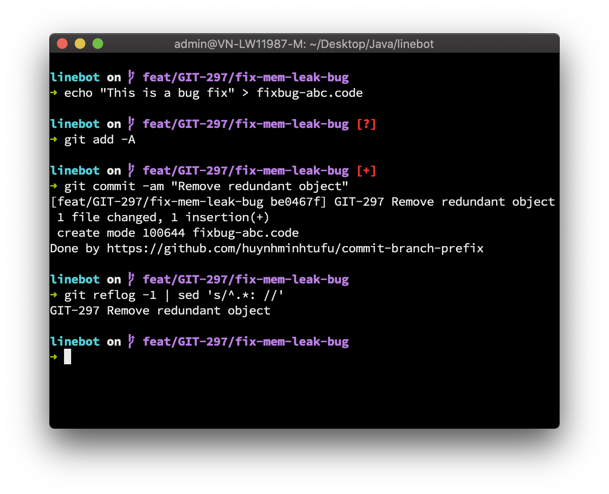

# Git commit branch prefix

Save your time with `Git commit branch prefix` and you'll never miss the commit prefix!



(WIP) Upcoming feature: **One command to add pre-commit-message your repository's git hooks**

## Install

### Oh My Zsh Plugin

Clone repositories

```
git clone git@github.com:huynhminhtufu/commit-branch-prefix.git $ZSH/plugins/commit-branch-prefix
```

Update your plugins array:

```
plugins=(... commit-branch-prefix)
```

### Typical Bash

```
curl -s https://raw.githubusercontent.com/huynhminhtufu/commit-branch-prefix/master/bash-install.sh | sudo bash /dev/stdin
```

## How to use

Name your branch like: feat/**TICKET-ID**/branch-description, where TICKET-ID is your ticket/issue ID you want to prefix your commits.

Then you can use:

```
git commit -m "Fix something"
```

It will actually commit "TICKET-ID Fix something" for you.

However, if your branch name is not named like above, the commit will not be prefixed.